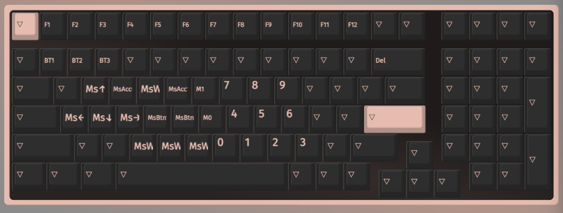
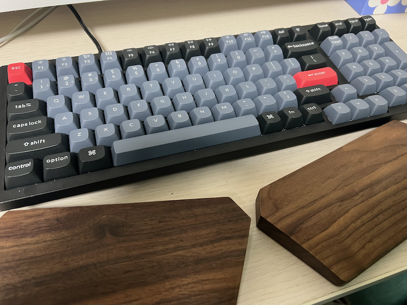

---
こんにちは、うまみちゃんです。
今年の２月ごろにKeychron K4 Proを購入しました。

購入後２月くらい使ってみての雑感を書き残しておきます。

<blockquote class="twitter-tweet">
My new gear… <a href="https://t.co/4RhCfZDCi5">pic.twitter.com/4RhCfZDCi5</a>
&mdash; ヒキニート!うまみちゃん (@onnsentmg) <a href="https://twitter.com/onnsentmg/status/1622882739924922368?ref_src=twsrc%5Etfw">February 7, 2023</a></blockquote> 

(喜びすぎてアイコスストアで開封している図)
 
 

スペックとしては下記のとおりです。

* 96％レイアウト
* 有線でも無線でも使える
* RGBバックライト
* ホットスワップ対応
* 茶軸

メカニカルキーボードを購入するのは初めてだったで、せっかくなら全部盛りにしたいと思ってつけれるオプションは全てつけました。
これだけ機能モリモリで２万円しないのはお財布に優しい。
 
 

軸についてはメカニカルキーボードっぽく「カチャカチャカチャ…ッターン！」したい気持ちと、あんまりにもうるさいのはちょっとなぁ…という気持ちがせめぎ合った結果茶軸にしています。

実際に使ってみたところ、自宅なら寝ている家族がいる時だけキータッチを優しめにすれば大丈夫かな、という感じ。もし職場で使うなら厳しさがありそう。
他の軸を使ったことがない状態でいうのもアレですが、初めてならば茶軸でメカニカルの楽しさとうるささを楽しむのが良い選択なんじゃないでしょうか。
せっかくホットスワップできるので、そのうち静音赤軸とかにもしてみたいです。

キー数については完全に日和ったなあという感じ。足りなかったら嫌だなあと思ってつけたテンキーとファンクションキーを全く使っていません。
いきなり65％くらいまで攻めるのもアリでした。

個人的に一番収穫があったのがUS配列で、かっこや鍵かっこ等の記号系とエンターキーが非常に打ちやすいです。Keychron関係ない気もしますが、そうでもない限りUS配列に手を出してなかったので、結果オーライです。
初めの１ヶ月くらいは記号で露骨にタイムラグがあったのですが、最近は前より速く正確に打てるようになってきました。

バックライトは虚無でオンにしていますが、なくてもまあ、、、  

キーマップはこんな感じ。通常レイヤーは全く弄らず、ファンクションキー押しで下記レイヤーに切り替わります。
  

マウスキーは手を動かしたくない時に若干便利。
あんまり使いこなせていないので、もうちょっと頭に覚えこませていきたいです。

予想外だったのは、キーボード自体の高さが結構あったこと。
長時間使っていると手の甲が結構痛くなってきます。
慣れとかそういう問題じゃない感じだったので、Flicoのパームレストを買って使っています。

https://amzn.asia/d/hbqrBmK

長さがわからなかったので分割型にしましたが特に問題なく使えています。
  

 

今後もこの調子でキーボード沼にハマっていきたいです。

(この記事はKeychron K4 Proで書きました)
