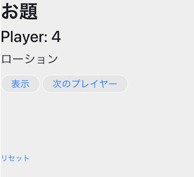

こんにちは, うまみちゃんです。


ChatGPTが話題ですね。
流行には積極的に触れていくべきなので, ChatGPT APIを利用してアプリを作ってみました。

[ChatGPTがワードウルフのお題をつくってくれるツール](https://umamichang.dev/wordwolf/)

---

まあタイトルで語るに落ちている感はあるのですが, 下記のプロンプトをAPIに投げて, 結果を表示しているだけです。ChatGPTは最強。
```
ワードウルフのお題を考えて, ２つの言葉を空白区切りで出力してください。
ジャンル(genre), 言葉の難しさ(difficulty, 1〜100）, 単語の距離（distance, 1〜100）は私が指定します。
なお, ジャンルは空白のことがあります

例)
“””
Input : genre[冷たいもの], difficulty[50], distance[30]
Output : ボールペン シャーペン
“””

Input : genre[{{genre}}], difficulty[{{difficulty}}, distance[{{distance}}]]
Output :
```

最初GPT-4で試していた時はもっと雑に頼むだけでいい感じの出力があったのですが, APIがこないので途中からGPT-3.5-turboを使うことにしました。
ただ, GPT-3.5だと出力でいきなりワードウルフのマスターを演じ始めたり, 文章で返してきたりと, かなり不安定になってしまいました。
やむを得ず世の人もすなるプロンプトエンジニアリングを頑張った結果が上記の文章です。


入力値の言葉の難しさと距離は色々試してみたのですが, あんまり出力に反映されてないようです。
距離固定で, 難しさだけを変えるとこう
```
ジャンル :  赤いもの
0回目, 難易度 : 10, 距離 : 50
['シャーベット', '夕焼け']
1回目, 難易度 : 20, 距離 : 50
['真紅', '鮮血']
2回目, 難易度 : 30, 距離 : 50
['バラ', '真紅']
3回目, 難易度 : 40, 距離 : 50
['ルビー', '赤銅鉱']
4回目, 難易度 : 50, 距離 : 50
['ルビー', '血液']
5回目, 難易度 : 60, 距離 : 50
['グレナディン', 'チョロトップ']
6回目, 難易度 : 70, 距離 : 50
['トマト', 'ルビー']
7回目, 難易度 : 80, 距離 : 50
['血液', '献血']
8回目, 難易度 : 90, 距離 : 50
['ワイン', 'ルビー']
9回目, 難易度 : 100, 距離 : 50
['クリムゾン', 'ルビー']
```

逆に距離をうごかすとこんな感じ
```
0回目, 難易度 : 50, 距離 : 10
['明治', '王政復古']
1回目, 難易度 : 50, 距離 : 20
['王政復古', '憲法改正']
2回目, 難易度 : 50, 距離 : 30
['和銅の改新', '平安京']
3回目, 難易度 : 50, 距離 : 40
['昭和', '戦争']
4回目, 難易度 : 50, 距離 : 50
['封建社会', '摂関政治']
5回目, 難易度 : 50, 距離 : 60
['大陸', '秦朝']
6回目, 難易度 : 50, 距離 : 70
['玄武岩', '狼煙']
7回目, 難易度 : 50, 距離 : 80
['尊号', '徳川慶喜']
8回目, 難易度 : 50, 距離 : 90
['ドイツ騎士団', '西晋']
9回目, 難易度 : 50, 距離 : 100
['大化の改新', '仮名文字']
```


友人とテストプレイ中に色々無茶振りをしてみたのですが, ユーザーが入力できる文字数を15文字までとしていることもあって, 悪いことをしようとしても無理でした。
ただし, 卑猥な言葉や公序良俗に反する言葉は普通に出てしまいます。
  


ただ, 前述の言葉の難しさ・距離が反映されないことを含め, 予期せぬ言葉が出ること自体がワードウルフ自体のルールと相まって, ゲームの盛り上がりにつながってしまうので, 結果オーライでした。
完全なる発想の勝利ですね


---
作成にあたっては難しいことは避けてできるだけ簡素に実装しようと心がけました。ただ, Webアプリの開発自体が初めてだったので勉強することが多く, ChatGPTくんに無限に教えてもらいながら, 開発していきました


使ったものとしてはとしては, 下記の通りです。
* バックエンドはPython+Flask
* WebサーバーはGunicorn+Nginx
* フロントエンドはBootstrap のクラスを雑に入れたHTMLと簡易なJavaScript 
* サーバーはGoogle Cloudsのcompute engineです。

コードは全部GitHubに公開しているので、気になった人は見てみてください。
[→Github](https://github.com/hikineet-umamichang/project_umamichang)

<br>
また、一応完成という形はとっていますが, 今後も追加したい機能が山ほどあります。随時改善して多くの人に遊んでもらえるように育てていきたいです。意見や感想などあったら、問い合わせフォームかTwitterに投げていただけると喜びます。

<br>
今後の追加予定

* 過去に生成されたお題を見れる機能
* UIの調整
* 全員にお題のジャンルを伝えるかを選択式に
* エセ芸術家, ニューヨークへ行く, 等のワードウルフライクゲームへの対応

たくさん遊んでね
